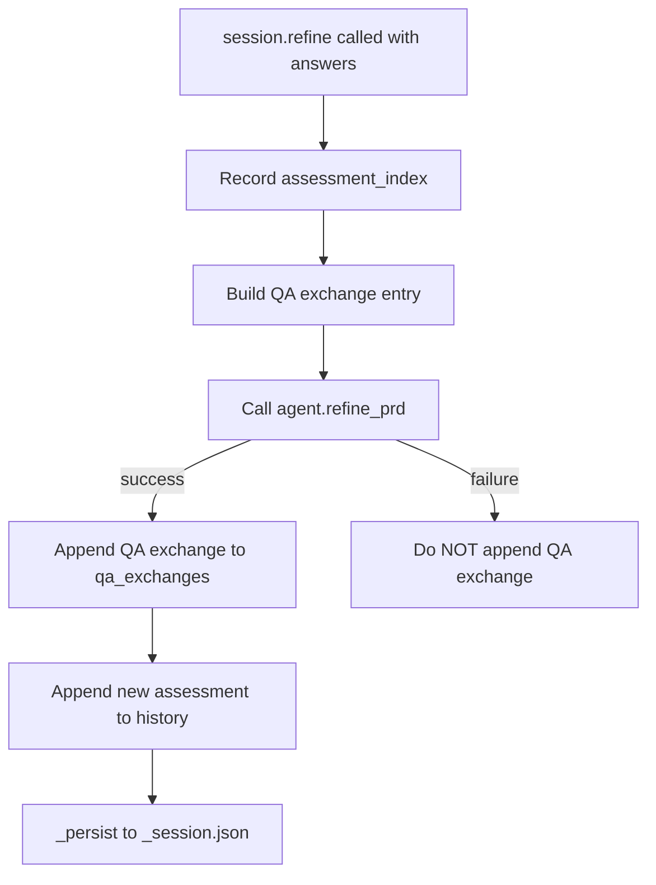

# Design Document: Refine Answer Recording

## Overview

Populates the existing `qa_exchanges` field in `_session.json` during
`SpecSession.refine()`. Each entry captures the answers dict, the index of
the assessment whose questions were answered, and a UTC timestamp. Only
`speclib/session.py` is modified.

## Architecture



### Module Responsibilities

1. `speclib/session.py` — Builds QA exchange entry and appends it to
   `_qa_exchanges` on successful refinement.

## Execution Paths

### Path 1: Refine records answers

1. `speclib/session.py: SpecSession.refine(answers)` — captures
   `assessment_index = len(self._assessment_history) - 1`
2. `speclib/session.py: SpecSession.refine` — captures timestamp via
   `_utcnow()` before the agent call
3. `speclib/agent.py: SpecAgent.refine_prd(...)` → `(str, Assessment)` —
   unchanged, called as before
4. `speclib/session.py: SpecSession.refine` — on success, appends
   `{"assessment_index": N, "answers": {...}, "timestamp": "..."}` to
   `self._qa_exchanges`
5. `speclib/session.py: SpecSession._persist()` — writes `qa_exchanges`
   to `_session.json` (already serializes this field)

### Path 2: Refine fails — no exchange recorded

1. `speclib/session.py: SpecSession.refine(answers)` — captures index and
   timestamp
2. `speclib/agent.py: SpecAgent.refine_prd(...)` — raises `AgentError`
3. `speclib/session.py: SpecSession.refine` — catches error, does NOT
   append to `_qa_exchanges`, persists error state, re-raises

## Components and Interfaces

### Modified: `SpecSession.refine()` in `speclib/session.py`

```python
async def refine(self, answers: dict[str, str]) -> Assessment:
    # ... existing state check ...
    assessment_index = len(self._assessment_history) - 1
    timestamp = _utcnow()

    # ... existing agent call ...

    # On success: record the exchange
    self._qa_exchanges.append({
        "assessment_index": assessment_index,
        "answers": dict(answers),
        "timestamp": timestamp,
    })

    # ... existing assessment_history append, state transition, persist ...
```

### New: `_utcnow()` module-level function

```python
def _utcnow() -> str:
    """Return current UTC time as ISO 8601 string. Patchable in tests."""
    from datetime import datetime, timezone
    return datetime.now(timezone.utc).isoformat()
```

## Data Models

### QA Exchange Entry

```json
{
  "assessment_index": 0,
  "answers": {
    "q1": "Answer to question 1",
    "q2": "Answer to question 2"
  },
  "timestamp": "2026-06-10T14:30:00+00:00"
}
```

### Updated `_session.json` (example after two refine rounds)

```json
{
  "state": "refining",
  "prd_path": "prd.md",
  "assessment_history": [
    {"quality": "needs_refinement", "summary": "...", "gaps": [...], "questions": [...]},
    {"quality": "needs_refinement", "summary": "...", "gaps": [...], "questions": [...]},
    {"quality": "ready", "summary": "...", "gaps": [], "questions": []}
  ],
  "qa_exchanges": [
    {"assessment_index": 0, "answers": {"q1": "...", "q2": "..."}, "timestamp": "2026-06-10T14:30:00+00:00"},
    {"assessment_index": 1, "answers": {"q3": "..."}, "timestamp": "2026-06-10T14:45:00+00:00"}
  ],
  "generated_artifacts": [],
  "mode": "interactive"
}
```

## Operational Readiness

No new operational concerns. This adds data to an existing persistence field
with no new external dependencies or state mutations beyond what `_persist()`
already performs.

## Correctness Properties

### Property 1: Exchange Count Matches Refine Count

*For any* session that has undergone N successful `refine()` calls,
`len(qa_exchanges)` SHALL equal N.

**Validates: Requirements 07-REQ-1.1, 07-REQ-1.E1**

### Property 2: Assessment Index Consistency

*For any* QA exchange entry at position M in `qa_exchanges`, the
`assessment_index` SHALL be a valid index into `assessment_history`
(i.e., `0 <= assessment_index < len(assessment_history)`) AND SHALL
equal M (the Mth refine answers the Mth assessment's questions).

**Validates: Requirements 07-REQ-1.3**

### Property 3: Exchange Schema Consistency

*For any* QA exchange entry, it SHALL contain exactly the keys
`assessment_index`, `answers`, and `timestamp`, where `assessment_index`
is an integer, `answers` is a dict with string keys and values, and
`timestamp` is a non-empty string.

**Validates: Requirements 07-REQ-2.1**

### Property 4: Failed Refine No-Append

*For any* `refine()` call that raises `AgentError`, the `qa_exchanges`
list SHALL have the same length before and after the call.

**Validates: Requirement 07-REQ-1.E1**

## Error Handling

| Error Condition | Behavior | Requirement |
|----------------|----------|-------------|
| Agent error during refine | Do not append QA exchange | 07-REQ-1.E1 |
| Existing session with empty qa_exchanges | Load and function normally | 07-REQ-1.E2 |

## Technology Stack

- Python 3.10+
- `datetime` stdlib module (for UTC timestamp)
- `json` stdlib module (already in use for persistence)

## Definition of Done

A task group is complete when ALL of the following are true:

1. All subtasks within the group are checked off (`[x]`)
2. All spec tests (`test_spec.md` entries) for the task group pass
3. All property tests for the task group pass
4. All previously passing tests still pass (no regressions)
5. No linter warnings or errors introduced
6. Code is committed on a feature branch and merged into `develop`
7. Feature branch is merged back to `develop`
8. `tasks.md` checkboxes are updated to reflect completion

## Testing Strategy

- **Unit tests** verify that `refine()` appends correctly formed QA exchange
  entries and that failed refines leave `qa_exchanges` unchanged.
- **Property tests** verify exchange count parity, index consistency, and
  schema consistency using generated assessment histories and answer sets.
- **Integration smoke test** runs a full refine through a real session
  (mocking only the agent API) and verifies the persisted `_session.json`
  contains the expected QA exchange.
