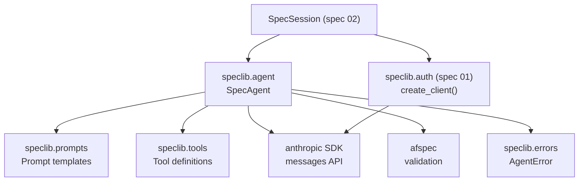

# Design Document: Agent Pipeline

## Overview

This spec implements the AI-driven core of speclib: a `SpecAgent` class that
uses the Anthropic messages API with tool use to assess PRDs, refine them
through Q&A, and generate spec artifacts. The agent pipeline is composed of
three modules (`agent.py`, `prompts.py`, `tools.py`) and integrates into
the `SpecSession` lifecycle from spec 02.

## Architecture



### Module Responsibilities

1. **speclib/agent.py** -- Core agent logic. Defines the `SpecAgent` class with
   async methods `assess_prd()`, `refine_prd()`, and `generate_artifacts()`.
   Handles API communication, retry logic, response parsing, and validation.
2. **speclib/prompts.py** -- Prompt templates. Functions that construct the
   system and user messages for assessment, refinement, and generation. Each
   function accepts parameters (PRD text, answers, previous artifacts) and
   returns formatted strings.
3. **speclib/tools.py** -- Tool definitions for structured output. Defines the
   JSON-schema-based tool specs (`submit_assessment`, `submit_prd_update`,
   `submit_artifact`) that constrain the model's output shape.
4. **speclib/errors.py** (extended) -- Adds `AgentError(SpeclibError)` to the
   existing exception hierarchy from spec 01.

## Execution Paths

### Path 1: PRD Assessment

1. `SpecSession.assess()` -- loads PRD text from `prd.md`, creates `SpecAgent`
2. `SpecAgent.assess_prd(prd_text, spec_name)` -- validates input not empty
3. `prompts.assessment_system_prompt()` -- builds system message
4. `prompts.assessment_user_prompt(prd_text, spec_name)` -- builds user message
5. `tools.assessment_tools()` -- returns tool definition list
6. `SpecAgent._call_api(messages, tools)` -- sends to Anthropic API with retry
7. `SpecAgent._extract_tool_call(response, "submit_assessment")` -- parses response
8. `SpecAgent._parse_assessment(tool_input)` -- validates and builds Assessment
9. `SpecSession` -- persists Assessment, transitions state to `assessing`

### Path 2: PRD Refinement

1. `SpecSession.refine(answers)` -- loads PRD text, retrieves last Assessment
2. `SpecAgent.refine_prd(prd_text, answers, previous_assessment)` -- validates inputs
3. `prompts.refinement_system_prompt()` -- builds system message
4. `prompts.refinement_user_prompt(prd_text, answers, previous_assessment)` -- builds user message
5. `tools.refinement_tools()` -- returns tool definitions (submit_prd_update + submit_assessment)
6. `SpecAgent._call_api(messages, tools)` -- sends to Anthropic API with retry
7. `SpecAgent._extract_tool_call(response, "submit_prd_update")` -- extracts updated PRD
8. `SpecAgent._extract_tool_call(response, "submit_assessment")` -- extracts new Assessment
9. `SpecSession` -- writes updated prd.md, persists Assessment, transitions state

### Path 3: Artifact Generation

1. `SpecSession.generate()` -- loads accepted PRD text
2. `SpecAgent.generate_artifacts(prd_text, spec_id, spec_name)` -- validates input
3. For each artifact in `["requirements", "test_spec", "tasks"]`:
   a. `prompts.generation_system_prompt()` -- builds system message
   b. `prompts.generation_user_prompt(prd_text, artifact_name, prior_artifacts)` -- builds user message with prior artifacts as context
   c. `tools.artifact_tool(artifact_name)` -- returns tool definition for this artifact
   d. `SpecAgent._call_api(messages, tools)` -- sends to Anthropic API with retry
   e. `SpecAgent._extract_tool_call(response, "submit_artifact")` -- extracts JSON
   f. `afspec.validate_artifact(artifact_name, content)` -- validates against schema
   g. If validation fails: raise `AgentError` with details
4. Returns `dict[str, Any]` mapping artifact names to parsed JSON
5. `SpecSession` -- writes each artifact file, runs cross-file validation, transitions to `generated`

### Path 4: Retry on Transient Error

1. `SpecAgent._call_api(messages, tools)` -- makes API call
2. API returns 429 or 5xx -- caught by retry logic
3. `_call_api` waits `base_delay * 2^attempt` seconds (1s, 2s, 4s)
4. If cumulative wait exceeds 30s or attempts exceed 3: raise `AgentError`
5. Otherwise: retry the request

## Components and Interfaces

### SpecAgent

```python
class SpecAgent:
    """Core agent wrapping the Anthropic client for spec operations."""

    def __init__(
        self,
        client: anthropic.Anthropic | anthropic.AnthropicBedrock | anthropic.AnthropicVertex,
        model: str,
    ) -> None:
        """Initialize with an Anthropic client and model name."""
        ...

    async def assess_prd(self, prd_text: str, spec_name: str) -> Assessment:
        """Send PRD to agent for assessment.

        Raises AgentError if prd_text is empty, the API call fails
        permanently, or the response cannot be parsed.
        """
        ...

    async def refine_prd(
        self,
        prd_text: str,
        answers: dict[str, str],
        previous_assessment: Assessment,
    ) -> tuple[str, Assessment]:
        """Send answers, get updated PRD and new assessment.

        Returns (updated_prd_text, new_assessment).
        Raises AgentError if answers is empty, IDs are unrecognized,
        or the API call fails.
        """
        ...

    async def generate_artifacts(
        self,
        prd_text: str,
        spec_id: str,
        spec_name: str,
    ) -> dict[str, Any]:
        """Generate requirements, test_spec, and tasks content.

        Returns dict mapping artifact name to parsed JSON content.
        Each artifact is validated before proceeding to the next.
        Raises AgentError on validation failure or API error.
        """
        ...

    async def _call_api(
        self,
        messages: list[dict[str, str]],
        tools: list[dict],
        system: str | None = None,
    ) -> anthropic.types.Message:
        """Send messages to the Anthropic API with retry logic.

        Retries up to 3 times on 429/5xx with exponential backoff.
        Raises AgentError on permanent failure or exhausted retries.
        """
        ...

    def _extract_tool_call(
        self,
        response: anthropic.types.Message,
        tool_name: str,
    ) -> dict:
        """Extract the input dict from a tool_use content block.

        Raises AgentError if the tool was not called or the response
        contains no tool_use blocks.
        """
        ...

    def _parse_assessment(self, tool_input: dict) -> Assessment:
        """Validate and construct an Assessment from tool input.

        Raises AgentError if required fields are missing or invalid.
        """
        ...
```

### Prompt Module (speclib/prompts.py)

```python
def assessment_system_prompt() -> str:
    """Return the system prompt for PRD assessment."""
    ...

def assessment_user_prompt(prd_text: str, spec_name: str) -> str:
    """Return the user message for PRD assessment."""
    ...

def refinement_system_prompt() -> str:
    """Return the system prompt for PRD refinement."""
    ...

def refinement_user_prompt(
    prd_text: str,
    answers: dict[str, str],
    previous_assessment: Assessment,
) -> str:
    """Return the user message for PRD refinement."""
    ...

def generation_system_prompt() -> str:
    """Return the system prompt for artifact generation."""
    ...

def generation_user_prompt(
    prd_text: str,
    artifact_name: str,
    prior_artifacts: dict[str, Any] | None = None,
) -> str:
    """Return the user message for generating one artifact.

    prior_artifacts is a dict of already-generated artifacts
    (e.g., {"requirements": {...}}) to provide as context.
    """
    ...
```

### Tool Definitions Module (speclib/tools.py)

```python
def assessment_tools() -> list[dict]:
    """Return tool definitions for PRD assessment.

    Defines the submit_assessment tool.
    """
    ...

def refinement_tools() -> list[dict]:
    """Return tool definitions for PRD refinement.

    Defines submit_prd_update and submit_assessment tools.
    """
    ...

def artifact_tool(artifact_name: str) -> list[dict]:
    """Return tool definition for generating one artifact.

    Defines the submit_artifact tool with schema appropriate
    for the given artifact_name.
    """
    ...

# Tool definition constants
SUBMIT_ASSESSMENT_TOOL: dict  # Full tool definition with input_schema
SUBMIT_PRD_UPDATE_TOOL: dict  # Full tool definition with input_schema
SUBMIT_ARTIFACT_TOOL: dict    # Full tool definition with input_schema
```

### AgentError (speclib/errors.py extension)

```python
class AgentError(SpeclibError):
    """Error during agent communication or response parsing.

    Attributes:
        detail: Human-readable description of what went wrong.
        __cause__: The underlying exception, if any.
    """

    def __init__(self, detail: str) -> None:
        super().__init__(detail)
        self.detail = detail
```

## Data Models

### Assessment (from spec 02, used by agent)

```python
@dataclass
class Assessment:
    quality: str         # "ready" | "needs_refinement" | "incomplete"
    summary: str         # Human-readable summary
    gaps: list[str]      # Identified gaps in the PRD
    questions: list[Question]  # Questions for the user
```

### Question (from spec 02, used by agent)

```python
@dataclass
class Question:
    id: str              # Unique identifier (e.g., "q1", "q2")
    text: str            # The question text
    context: str         # Why this question matters
    options: list[str]   # Suggested answer options (may be empty)
    required: bool       # Whether the user must answer
```

### Tool Input Schema: submit_assessment

```json
{
  "name": "submit_assessment",
  "description": "Submit a structured assessment of the PRD quality.",
  "input_schema": {
    "type": "object",
    "required": ["quality", "summary", "gaps", "questions"],
    "properties": {
      "quality": {
        "type": "string",
        "enum": ["ready", "needs_refinement", "incomplete"]
      },
      "summary": {
        "type": "string",
        "description": "Brief summary of the PRD quality and main findings."
      },
      "gaps": {
        "type": "array",
        "items": {"type": "string"},
        "description": "List of identified gaps or weaknesses in the PRD."
      },
      "questions": {
        "type": "array",
        "items": {
          "type": "object",
          "required": ["id", "text", "context", "options", "required"],
          "properties": {
            "id": {"type": "string"},
            "text": {"type": "string"},
            "context": {"type": "string"},
            "options": {
              "type": "array",
              "items": {"type": "string"}
            },
            "required": {"type": "boolean"}
          }
        },
        "description": "Questions for the user to improve the PRD."
      }
    }
  }
}
```

### Tool Input Schema: submit_prd_update

```json
{
  "name": "submit_prd_update",
  "description": "Submit the updated PRD text incorporating user answers.",
  "input_schema": {
    "type": "object",
    "required": ["updated_prd"],
    "properties": {
      "updated_prd": {
        "type": "string",
        "description": "The full updated PRD text (body only, no frontmatter)."
      }
    }
  }
}
```

### Tool Input Schema: submit_artifact

```json
{
  "name": "submit_artifact",
  "description": "Submit the generated artifact content as JSON.",
  "input_schema": {
    "type": "object",
    "required": ["artifact_name", "content"],
    "properties": {
      "artifact_name": {
        "type": "string",
        "enum": ["requirements", "test_spec", "tasks"]
      },
      "content": {
        "type": "object",
        "description": "The artifact content conforming to the spec-format v1.2 JSON schema."
      }
    }
  }
}
```

### Anthropic Messages API Usage

```python
# Example: assessment call
response = await client.messages.create(
    model=model,
    max_tokens=4096,
    system=assessment_system_prompt(),
    messages=[
        {"role": "user", "content": assessment_user_prompt(prd_text, spec_name)}
    ],
    tools=assessment_tools(),
    tool_choice={"type": "any"},  # Force tool use
)
```

## Correctness Properties

### Property 1: Assessment quality enum is valid

*For any* response from `assess_prd()`, THE `quality` field SHALL be one of
`"ready"`, `"needs_refinement"`, or `"incomplete"`. No other values are
accepted.

**Validates: Requirements 03-REQ-1.2**

### Property 2: Non-ready assessments have questions

*For any* Assessment where `quality != "ready"`, THE `questions` list SHALL
be non-empty.

**Validates: Requirements 03-REQ-1.5**

### Property 3: Artifact generation order is deterministic

*For any* invocation of `generate_artifacts()`, THE artifacts SHALL be
generated in the fixed order: `requirements`, `test_spec`, `tasks`. The
test_spec generation prompt always includes requirements content, and the
tasks generation prompt always includes both requirements and test_spec
content.

**Validates: Requirements 03-REQ-3.1, 03-REQ-3.6, 03-REQ-3.7**

### Property 4: Retry count is bounded

*For any* transient API error sequence, THE retry logic SHALL make at most
3 additional attempts (4 total calls). The cumulative wait SHALL NOT exceed
30 seconds.

**Validates: Requirements 03-REQ-5.1, 03-REQ-5.E2**

### Property 5: Failed generation does not corrupt state

*For any* `AgentError` raised during `generate_artifacts()` or the session's
`generate()` method, THE session state SHALL NOT advance to `generated`.
Any artifacts written to disk before the failure SHALL remain intact.

**Validates: Requirements 03-REQ-6.4, 03-REQ-6.E1**

## Error Handling

| Error Condition | Behavior | Requirement |
|----------------|----------|-------------|
| Empty PRD text | Raise AgentError immediately, no API call | 03-REQ-1.E1 |
| Tool not invoked by model | Raise AgentError (no structured output) | 03-REQ-1.E3 |
| Malformed tool response | Raise AgentError with field details | 03-REQ-1.E2 |
| Empty answers dict | Raise AgentError immediately | 03-REQ-2.E1 |
| Unrecognized question IDs | Raise AgentError listing bad IDs | 03-REQ-2.E2 |
| Missing assessment in refinement | Raise AgentError | 03-REQ-2.E3 |
| Empty PRD for generation | Raise AgentError immediately | 03-REQ-3.E1 |
| Artifact tool not invoked | Raise AgentError | 03-REQ-3.E2 |
| Schema validation failure | Raise AgentError with artifact name and errors | 03-REQ-3.E3 |
| API 429 / 5xx | Retry up to 3 times, exponential backoff | 03-REQ-5.1 |
| API 4xx (not 429) | Raise AgentError immediately | 03-REQ-5.3 |
| All retries exhausted | Raise AgentError wrapping original error | 03-REQ-5.2 |
| Connection timeout | Treat as transient, retry | 03-REQ-5.E1 |
| Cumulative wait > 30s | Abandon retries, raise immediately | 03-REQ-5.E2 |
| Missing prompt parameter | Raise ValueError | 03-REQ-4.E1 |
| Agent error during session op | No state transition, persist error, re-raise | 03-REQ-6.4 |
| Partial generation failure | Keep partial artifacts, stay in generating | 03-REQ-6.E1 |

## Technology Stack

- Python 3.14+
- `anthropic` -- Anthropic Python SDK (messages API, tool use, async support)
- `afspec` (speclib-python) -- spec format validation, JSON schema definitions
- `asyncio` -- async I/O for non-blocking API calls
- `speclib.auth` (spec 01) -- `create_client()` for Anthropic client creation
- `speclib.session` (spec 02) -- `SpecSession`, `Assessment`, `Question` types

## Definition of Done

A task group is complete when ALL of the following are true:

1. All subtasks within the group are checked off (`[x]`)
2. All spec tests (`test_spec.md` entries) for the task group pass
3. All property tests for the task group pass
4. All previously passing tests still pass (no regressions)
5. No linter warnings or errors introduced
6. Code is committed on a feature branch and merged into `develop`
7. `tasks.md` checkboxes are updated to reflect completion

## Operational Readiness

- **Logging:** All API calls, retries, and errors are logged at DEBUG level via
  the standard `logging` module. AgentError messages include enough context
  (artifact name, retry count, HTTP status) for triage without exposing API keys.
- **Metrics hooks:** `_call_api` records attempt count and cumulative latency in
  attributes on the returned response, allowing callers to emit metrics.
- **Graceful degradation:** Transient API failures are retried with bounded
  backoff; permanent failures surface immediately as AgentError so the session
  can persist partial state and resume later.
- **Secret handling:** The Anthropic API key is never logged, serialized to
  `_session.json`, or included in AgentError messages.

## Testing Strategy

- **Unit tests** for `SpecAgent` methods with mocked Anthropic client,
  verifying correct prompt construction, tool extraction, and error handling.
- **Unit tests** for prompt templates verifying they include required
  parameters and produce non-empty strings.
- **Unit tests** for tool definitions verifying JSON schema structure.
- **Property tests** for assessment quality enum validity and question
  presence invariants.
- **Property tests** for retry logic bounding.
- **Integration tests** for the full session.assess() -> session.refine() ->
  session.generate() flow with a mocked Anthropic client that returns
  realistic tool_use responses.
- **Edge case tests** for all error conditions in the error handling table.
