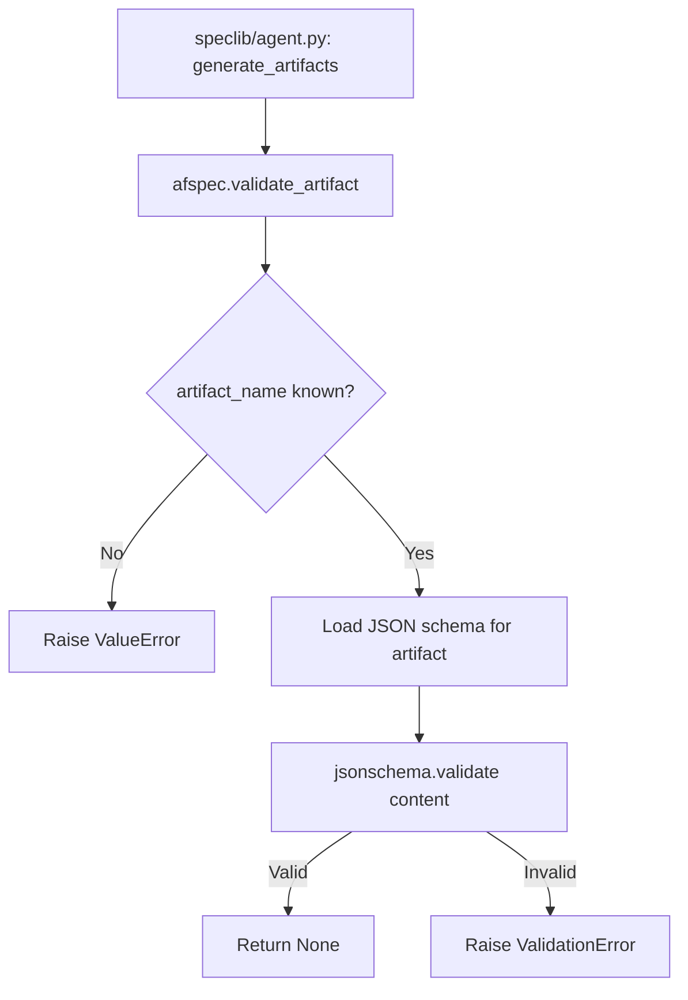

# Design Document: afspec.validate_artifact

## Overview

Implements single-artifact JSON schema validation in the local `afspec` stub
package. Bundles three JSON schema files copied from `speclib-python` and
provides a `validate_artifact(artifact_name, content)` function that validates
one artifact dict at a time.

## Architecture



### Module Responsibilities

1. `packages/afspec/afspec/__init__.py` — Re-exports `validate_artifact` and
   `ValidationError`.
2. `packages/afspec/afspec/validation.py` — Implements `validate_artifact()`,
   schema loading, and the name-to-schema mapping.
3. `packages/afspec/afspec/schemas/` — Bundled JSON schema files.
4. `speclib/agent.py` — Call site; removes graceful skip after stub is
   implemented.

## Execution Paths

### Path 1: Valid artifact passes validation

1. `speclib/agent.py: validate_artifact(artifact_name, content)` — delegates
   to `afspec.validate_artifact`
2. `packages/afspec/afspec/validation.py: validate_artifact(artifact_name,
   content)` — looks up schema file name from `_SCHEMA_MAP`
3. `packages/afspec/afspec/validation.py: _load_schema(schema_filename)` →
   `dict` — loads and parses JSON schema via `importlib.resources`
4. `jsonschema.validate(content, schema)` — validates, returns None
5. `validate_artifact` returns None

### Path 2: Invalid artifact fails validation

1. `speclib/agent.py: validate_artifact(artifact_name, content)` — delegates
2. `packages/afspec/afspec/validation.py: validate_artifact` — loads schema
3. `jsonschema.validate(content, schema)` — raises
   `jsonschema.ValidationError`
4. `validate_artifact` catches it, raises
   `afspec.ValidationError(artifact_name, errors)`

### Path 3: Unknown artifact name

1. `speclib/agent.py: validate_artifact(artifact_name, content)` — delegates
2. `packages/afspec/afspec/validation.py: validate_artifact` — `artifact_name`
   not in `_SCHEMA_MAP`
3. Raises `ValueError` listing valid names

## Components and Interfaces

### `validate_artifact` function

```python
def validate_artifact(artifact_name: str, content: dict) -> None:
    """Validate a single artifact dict against its JSON schema.

    Args:
        artifact_name: One of "requirements", "test_spec", "tasks".
        content: The artifact content dict to validate.

    Raises:
        ValueError: If artifact_name is not recognized.
        ValidationError: If content does not conform to the schema.
    """
```

### `ValidationError` exception

```python
class ValidationError(Exception):
    def __init__(self, artifact_name: str, errors: list[str]) -> None:
        self.artifact_name = artifact_name
        self.errors = errors
        super().__init__(
            f"Artifact '{artifact_name}' failed validation: "
            + "; ".join(errors)
        )
```

### Schema mapping

```python
_SCHEMA_MAP = {
    "requirements": "requirements.v1.json",
    "test_spec": "test_spec.v1.json",
    "tasks": "tasks.v1.json",
}
```

## Data Models

### Bundled Schema Files

Copied from `speclib-python/afspec/schemas/`:

- `requirements.v1.json` (267 lines)
- `test_spec.v1.json` (152 lines)
- `tasks.v1.json` (136 lines)

## Operational Readiness

No new operational concerns. Validation is synchronous and in-process.
Schema files are bundled — no network access needed.

## Correctness Properties

### Property 1: Valid Content Passes

*For any* artifact content dict that conforms to its JSON schema,
`validate_artifact` SHALL return `None` without raising.

**Validates: Requirements 08-REQ-1.2**

### Property 2: Invalid Content Fails

*For any* artifact content dict that violates its JSON schema (missing
required fields, wrong types), `validate_artifact` SHALL raise
`ValidationError`.

**Validates: Requirements 08-REQ-1.3**

### Property 3: Name-Schema Bijection

*For any* valid artifact name, `validate_artifact` SHALL load the
corresponding schema file. For any unknown name, it SHALL raise `ValueError`.

**Validates: Requirements 08-REQ-1.4, 08-REQ-1.E1**

### Property 4: Error Detail Preservation

*For any* `ValidationError` raised by `validate_artifact`, the exception
SHALL contain the artifact name and at least one error description string.

**Validates: Requirements 08-REQ-4.2**

## Error Handling

| Error Condition | Behavior | Requirement |
|----------------|----------|-------------|
| Unknown artifact name | Raise ValueError | 08-REQ-1.E1 |
| Content missing required fields | Raise ValidationError | 08-REQ-1.E2 |
| Content wrong types | Raise ValidationError | 08-REQ-1.3 |

## Technology Stack

- Python 3.10+
- `jsonschema` library (new dependency for the stub package)
- `importlib.resources` (stdlib, for loading bundled schemas)

## Definition of Done

A task group is complete when ALL of the following are true:

1. All subtasks within the group are checked off (`[x]`)
2. All spec tests (`test_spec.md` entries) for the task group pass
3. All property tests for the task group pass
4. All previously passing tests still pass (no regressions)
5. No linter warnings or errors introduced
6. Code is committed on a feature branch and merged into `develop`
7. Feature branch is merged back to `develop`
8. `tasks.md` checkboxes are updated to reflect completion

## Testing Strategy

- **Unit tests** in `tests/test_afspec_validation.py` verify `validate_artifact`
  accepts valid content, rejects invalid content, and handles edge cases.
- **Property tests** use Hypothesis to generate artifact dicts and verify the
  valid/invalid invariants.
- **Integration smoke test** calls `validate_artifact` with real schema files
  to verify bundled schemas load and parse correctly.
